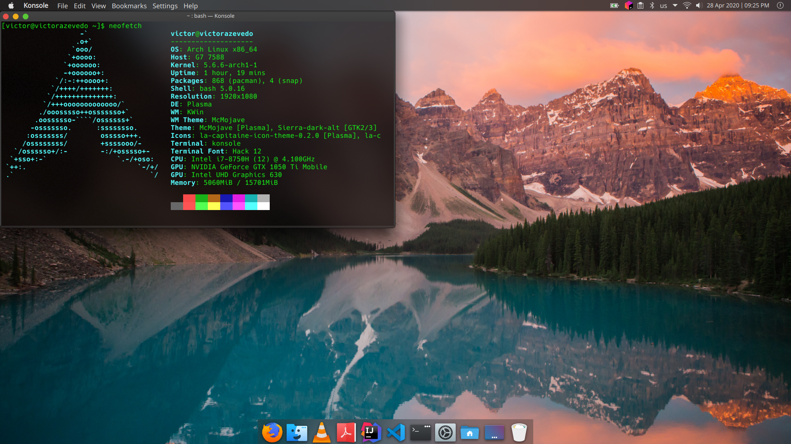

# My .dotfiles

This is my Arch Linux configuration with MacMojave theme. Soon I intend to buy a MacBook. Then, I made this configurations
in my Arch to get used to MacOS design and some functionalities.
I'm not a advanced user of Linux, but since I started to programming I use Linux. I've already pass many distros. Personally, Arch is my favorite one.
As I had to change my laptop several times and configurating everything again, a big friend [Pablo Aguilar](https://github.com/thepabloaguilar) suggested me to save my .dotfiles. Then everytime that I change my laptop, I won't spend more time configurating it.

My setup:
* Distro: [Arch Linux](https://www.archlinux.org/)
* Window Manager: [KWin](https://github.com/KDE/kwin)
* Desktop Environment: [Plasma](https://kde.org/plasma-desktop)
* Theme: [McMojave](https://github.com/vinceliuice/McMojave-kde)
* Terminal: [konsole](https://kde.org/applications/system/org.kde.konsole)



To setup .dotfiles to home directory, execute the following commands:

```
    git clone git@github.com:phakiller/dotfiles.git
    cd dotfiles
    ./setup-dotfiles
```